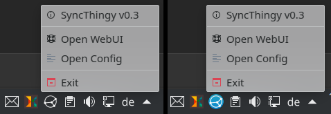

# SyncThingy
SyncThingy = Synthing + simple tray indicator



[](https://flathub.org/apps/details/com.github.zocker_160.SyncThingy)

## Motivation

Why yet another Syncthing tray / statusbar / wrapper / ui ... application?

The answer is simple: there is currently no application available as Flatpak and on Flathub, which offers just the bare minimum: Syncthing and a tray icon.

## Configuration

Configuration file can be found under `~/.var/app/com.github.zocker_160.SyncThingy/config/SyncThingy`

- `autostart` can be `true` or `false`
- `icon` can be set to `default`, `white` or `black`
- `url` defines the link opened when selecting `Open WebUI`
- `notifications` can be `true` or `false`

## Install background service

**Note**: this feature is mainly targeted at Steam Deck users, that want to have it running in the background when in Gaming Mode.
It does not really make much sense to use this on a normal Linux Desktop.

- (Steam Deck) switch to Desktop Mode
- right-click the SyncThiny icon in the system tray
- select `Settings`
- press `install as system service` button
- press `copy to clipboard`
- open terminal (`konsole` on Steam Deck)
- paste the command and hit enter (press `paste` in the top right on Steam Deck)
- (Steam Deck) open virtual keyboard with `STEAM` + `X` and press `R2` or `Enter` button

## Compile from source

**Build dependencies:**

- `build-essential`
- `qt5-default` || `qtbase5-dev` `qtbase5-dev-tools`
- `libportal-qt5-dev`

```bash
git clone https://github.com/zocker-160/SyncThingy.git
cd SyncThingy
cmake -S . -B out
cd out
make
sudo make install (optional)
```

### Note for non-Flatpak users

You will need to have `syncthing` installed and available in `$PATH`, in order to make this work.

**Running outside of Flatpak is not supported, you are on your own.**

### Links

- [Syncthing Github page](https://github.com/syncthing/syncthing)
- [SyncThingy on Flathub](https://flathub.org/apps/details/com.github.zocker_160.SyncThingy)
